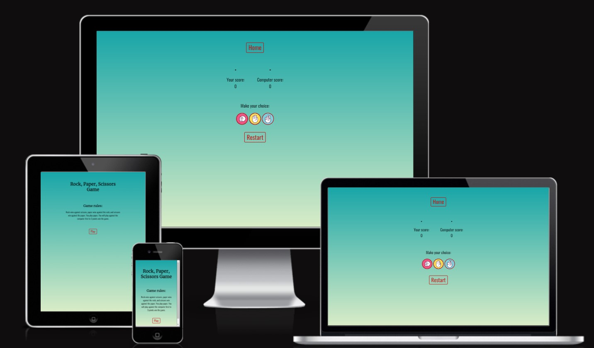
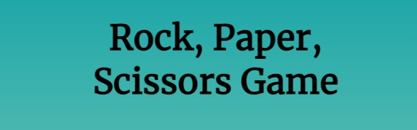
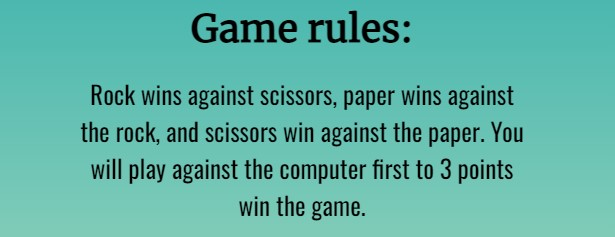
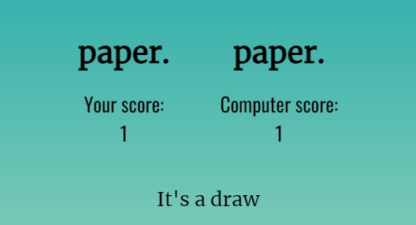
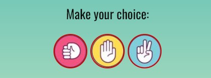
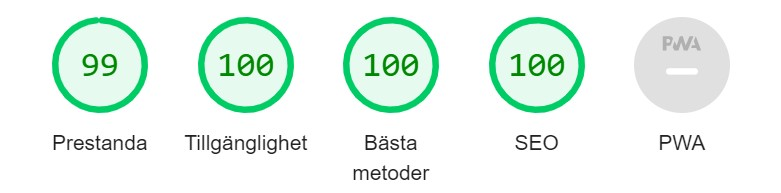
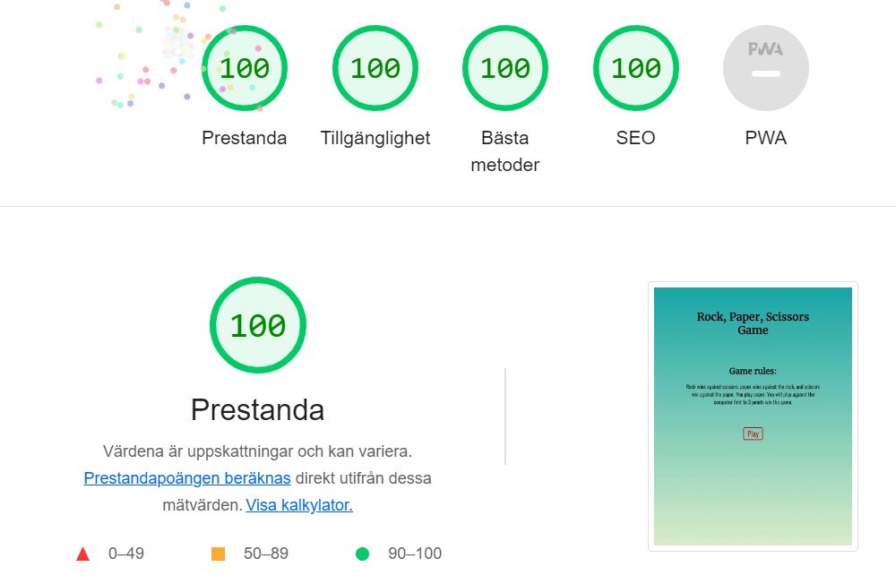
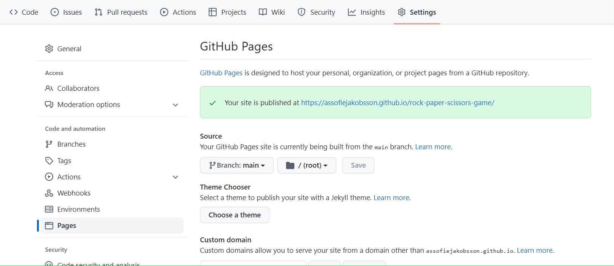

# Rock Paper Scissors Game

This game can help you and those around you, make difficult or fun decisions.
Why choose this computer game when you can do it directly with your own hands? Because you can't cheat in this game because the computer chooses randomly. And in this way, you avoid unnecessary misunderstandings and quarrels.

The target audience for this game is adults and children who want to learn and play a simple and fun game.

## Landing Page

- __Layout__

### The layout is designed so that the user can quickly and easily understand and use the pages and the game. The Landing page has the following feature: 

  - Title, are the game name and It is easy to read.

 

  - Game rules that are easy to read and understand. 
    This can make the user finish reading and understand the game which makes the game more enjoyable for the user.

  - Play button, takes the user directly to the game. Which opens in another tab. 
    This makes it easy for the user to navigate. The button has the same design as the remaining buttons in the game.

## Game Page

- __Layout__

### The layout is designed so that the user can quickly and easily understand and use the page. The Game page has the following feature: 

  - Home button, is located at the top of the page. And it takes the user back to the Landing page in a new tab. The button has the same design as the remaining buttons. This facilitates the user's navigation on the page.

  - Game selection and points. On the left, the user's choices and scores are displayed. And on the right is the computer's choice and score. This makes it easy for the user to keep track of the progress in the game.
  - Game notification, announces who wins the round and the entire game. This clarifies the result for the user. The game message is placed below the user and computer score in the center in the screen.

  - Game option buttons, are placed under the game message, with a prompt to make their choice. This makes it easy for the user to understand what to do. The game option buttons are designed with a background image of rock scissors or paper.

  - Restart button, is located at the bottom of the page. And it restarts the game. 
  This makes it easier for the user because the user can restart the game whenever he wants. And no need to wait for the game to end.
  The button has the same design as the remaining buttons.

## Features I want to add

- __Images for the user's and the computer's choice.__
- __Add so two users can play against each other.__
  

## Testing 

- __I have tested that everything works and looks good on different browsers: Chrome, Edge, and Firefox.__
- __I have tested so the page looks good on all screen sizes using devtools in browsers and https://ui.dev/amiresponsive.__
- __I was confirmed that the colors and fonts I have chosen work well for ease of use. I tested this through friends' reviews and lighthouse in dev tools. See the result from the lighthouse below.__ 

### Mobile

  

### Computer

 

## Validator Testing

- __Html__

  - The html code was approved in the W3C validator.

- __Css__

  - The css code was approved in the W3C validator (jigsaw).

- __JavaScript__

  - The javascript code was approved in the JSHint JavaScript Validator.

## Bugs

- __Solved Bugs__

  - I had problems removing the text decoration on my link and it was because I used spaces. 
I wrote like this:  
 a #btn-play  
 but I would write like this:  
 a#btn-play.

- __Unfixed Bugs__

  - None.

## Deployment

### The site was deployd to GitHub pages. The steps to deployd are as follows:

  - Log in to GitHub and click on the repository you want to deploy.
  - Select settings and click on pages to the left in the menu.
  - From the source section in the left dropdown-menue select branch main.
  - In the right dropdown-menu for folder select /(rot).
  - Click save and the page deploy after auto-refresh.
  - It should look like the picture below.

The live link can be found here - [Rock, Paper, Scissors Game](https://assofiejakobsson.github.io/rock-paper-scissors-game/)

## Credits

### Content

- __For my Game select buttons, I've used a lot of the code from Code insintute "Portfolio Project Scope-video".__
- __I also got some help with the game over function from my mentor and tutor.__
- __My starting code I get from this [youtube video](https://www.youtube.com/watch?v=RwFeg0cEZvQ)__
- __The code for the background-image linear-gradient did I get from [W3Schools](https://www.w3schools.com/cssref/func_linear-gradient.asp).__
- __I have used [Code-Institute-Solutions/readme-template](https://github.com/Code-Institute-Solutions/readme-template/blob/master/README.md)  for the srukture in the README.md file.__

 ### Media
 
 - __The images for the selection buttons did I take from [Pixabay](https://pixabay.com/).__
 - __The color did I take from [W3Schools](https://www.w3schools.com/colors/colors_mixer.asp).__

